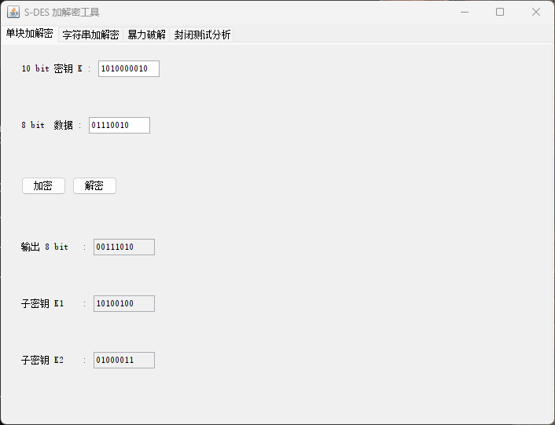
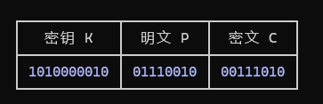
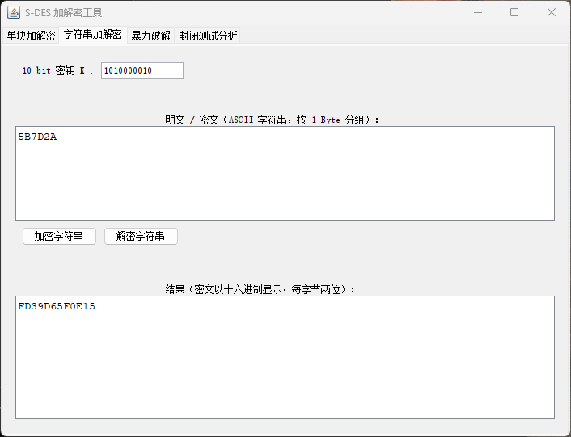
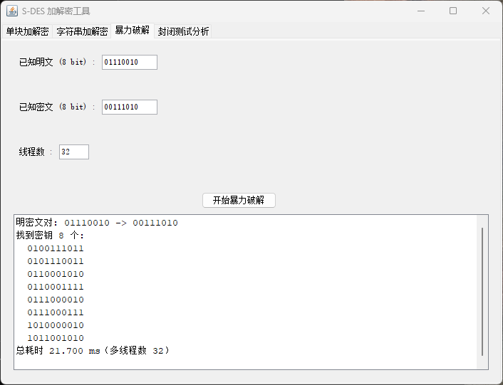
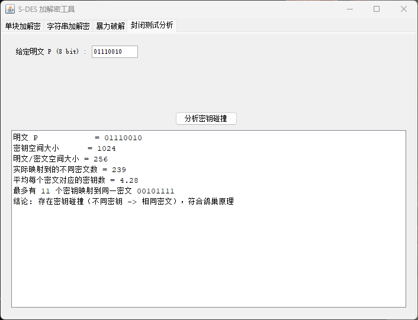

# S-DES 加解密程序设计报告

## 一、小组成员与分工

| 姓名 | 分工 |
|---|---|
| 杨翔宇 | S-DES 核心算法（`SDES.java`）：密钥扩展、加解密流程、置换表与 S 盒封装（第 1、2 关） |
| 王海丞 | 图形界面（`SDESGUI.java`）：四个标签页交互设计、输入校验与字符串模式（第 1、3 关界面） |
| 刘焱 | 暴力破解与封闭测试（`BruteForce.java`）+ TCP 网络通信（`SDESClient/SDESServer.java`）（第 3 关 Socket、第 4、5 关） |

## 二、开发环境与标准设定

- 语言：Java（JDK 25），图形界面框架：Swing
- 分组长度 8 bit，密钥长度 10 bit
- 置换表（P10 / P8 / IP / IP⁻¹ / E/P / P4）采用教材标准值
- S-box2（即第二个 S 盒 S1）采用课程文档自定义值，第 2、3 行与教材不同：

```
S-box2 = 0 1 2 3
         2 3 1 0
         3 0 1 2
         2 1 0 3
```

## 三、各关设计思路与实现

### 第 1 关：基本测试

**设计思路**：实现 S-DES 的两大模块——密钥扩展（P10 → 左右各 5 位循环左移 LS-1/LS-2 → P8，得到子密钥 K1、K2）与加解密主流程（IP → fk(K1) → 交换 SW → fk(K2) → IP⁻¹）。解密复用同一流程，只是子密钥使用顺序相反（先 K2 后 K1）。位串用 0/1 字符串表示，置换用查表实现，S 盒按「行 = 首尾两位、列 = 中间两位」查 4×4 表。GUI 提供 8 bit 数据 + 10 bit 密钥输入、加密/解密按钮与密文输出，并额外显示 K1/K2 便于核对。

**测试结果**：密钥 `1010000010`、明文 `01110010` → 密文 `00111010`，解密可还原，加解密自洽。



### 第 2 关：交叉测试

**设计思路**：为保证异构平台结果一致，所有置换表与 S 盒都做成类顶部的常量，算法流程严格按标准步骤实现，不依赖任何平台特性（位串用字符串、查表用数组），因此对同一输入结果确定唯一。与同组程序只需用同一参考向量（密钥 `1010000010`、明文 `01110010`）对比，密文都应为 `00111010`。



### 第 3 关：扩展功能（ASCII 字符串 + TCP Socket）

**设计思路**：字符串模式把 ASCII 字符串按 1 Byte 分组，逐字节用同一密钥加密（类似 ECB 模式），密文以十六进制串显示（解密后可能是乱码）。进一步把加解密应用到 TCP Socket 通信：客户端把明文加密后通过 Socket 发送密文，服务器接收后用共享密钥解密并回显，演示 S-DES 在网络通信中的实际应用。

**通信实测**：客户端发送明文 `Information Security`，密文为 `AF5AD42F3A46BD8EC72F5A624FF860693AC78E06`，服务器成功解密还原。



### 第 4 关：暴力破解

**设计思路**：密钥空间只有 2^10 = 1024，可直接穷举。用 `ExecutorService` 线程池把密钥空间按线程数切段、并行尝试，命中即记录；用 `System.nanoTime()` 计时。对明密文对 `01110010 → 00111010` 共找到 8 个密钥（其中含真实密钥 `1010000010`），多线程耗时约 34 ms。

```
找到的 8 个密钥:
0100111011, 0101110011, 0110001010, 0110001111,
0111000010, 0111000111, 1010000010, 1011001010
```



### 第 5 关：封闭测试

**设计思路**：对固定明文遍历全部 1024 个密钥，统计各密文被多少个密钥映射到。结论：密钥空间（1024）远大于明文/密文空间（256），由鸽巢原理必然存在「不同密钥加密得到相同密文」的碰撞。

**实测数据**（明文 `01110010`）：

| 指标 | 数值 |
|---|---|
| 实际映射到的不同密文数 | 239 |
| 平均每个密文对应的密钥数 | 4.28 |
| 最多密钥撞到同一密文 | 11 个（密文 `00101111`） |

**结论**：① 随机明密文对可能存在多个密钥（本例 8 个）；② 任意明文分组下必然存在密钥碰撞。



## 四、测试数据汇总

| 项目 | 数值 |
|---|---|
| 参考向量 | K=`1010000010`, P=`01110010` → C=`00111010` |
| 子密钥 K1 / K2 | `10100100` / `01000011` |
| 暴力破解耗时 | 约 34 ms（多线程） |
| 碰撞：不同密文数 / 平均密钥数 / 最大碰撞数 | 239 / 4.28 / 11 |

## 五、运行说明

```bash
javac -encoding UTF-8 *.java   # 中文注释需指定 UTF-8

java SDESGUI                    # 图形界面（第 1~5 关）
java SDES                       # 核心算法自测（参考向量）
java BruteForce                 # 暴力破解 + 碰撞分析自测

# TCP 通信演示：先开服务器，再开客户端
java SDESServer                 # 终端 1
java SDESClient "要发送的明文"  # 终端 2
```

## 六、配套文档

- 《用户指南.md》：软件使用方法（图形界面、命令行自测、TCP 通信演示、常见问题）
- 《开发手册.md》：核心组件封装后的接口文档（各方法的签名、参数、返回值与示例）
